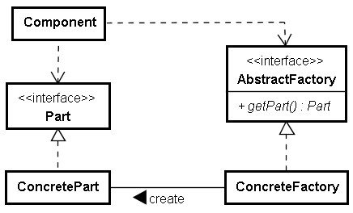

# Abstract Factory 模式

如果您**需要一組可以隨時抽換的元件，並且希望可以簡單地一次抽換**，則可以考慮使用 Abstract Factory 。例如視窗程式中視感（Look-and-feel）元件的調換，就是 Abstract Factory 的應用場合。

以下是 Abstract Factory 的簡單實現，程式中 Rectangle 依賴於 PointCornerFactory 的公開定義，使用 PointCornerFactory 所提供的一組元件來繪製矩形：

```java
interface PointCornerFactory {
    Point getPoint();
    Corner getCorner();
}

interface Point {
    void line(int width);
}

interface Corner {
    void leftUp();
    void rightUp();
    void leftDown();
    void rightDown();
}

class Rectangle {
    private int width;
    private int height;
    
    Rectangle(int width, int height) {
        this.width = width;
        this.height = height;
    }
    
    void paint(PointCornerFactory factory) {
        Point point = factory.getPoint();
        Corner corner = factory.getCorner();
        corner.leftUp();
        point.line(width - 2);
        corner.rightUp();
        System.out.println();
        for(int i = 0; i < height - 2; i++) {
            point.line(width);
            System.out.println();
        }
        corner.leftDown();
        point.line(width - 2);
        corner.rightDown();
        System.out.println();
    }
}
```

依您所提供的 PointCornerFactory 、 Point 與 Corner 實作之不同，可以繪製出不同外觀的矩形，例如：

```java
public class Main {
    public static void main(String[] args) {
        Rectangle rect = new Rectangle(20, 10);
        PointCornerFactory factory =
            new PointCornerFactory() {
                public Point getPoint() {
                    return new Point() {
                        public void line(int width) {
                            for(int i = 0; i < width; i++) {
                                System.out.print("-");
                            }
                        }
                    };
                }
                
                public Corner getCorner() {
                    return new Corner() {
                        public void leftUp() { System.out.print('+'); }
                        public void rightUp() { System.out.print('+'); }
                        public void leftDown() { System.out.print('+'); }
                        public void rightDown() { System.out.print('+'); }
                    };
                }
            };
        rect.paint(factory);        
    }
}
```

如果您要呈現不同的矩形外觀，則可以提供另一組 PointCornerFactory 、 Point 、 Conrer 實作，對 Rectangle 而言，就可達成一次抽象所有元件的需求。

下圖為 AbstractFactory 的類別圖：



圖中 AbstractFactory 、 Part 指的是，物件必須具有 AbstractFactory 、 Part 所定義之公開協定，而非專指 Java 中的 interface 定義。對於靜態語言來說，例如 Java ，必須使用型態來宣告變數，因此根據需求，可以使用 interfact 或 abstract class 來定義 AbstractFactory 、 Part 所定義之公開協定。對於動態語言來說，例如 Python ，真正的型態資訊是在物件之上（而非變數），因此要求的是物件必須具有 AbstractFactory 、 Part 之公開方法（無論是「哪一種」物件1），例如以下是 Python 的 Abstract Factory 實現範例：

```python
class Rectangle:
    def __init__(self, width, height):
        self.width = width
        self.height = height
    
    def paint(self, factory):
        point = factory.getPoint()
        corner = factory.getCorner()
        corner.leftUp()
        point.line(self.width - 2)
        corner.rightUp()
        print()
        for i in range(self.height - 2):
            point.line(self.width)
            print()        
        corner.leftDown()
        point.line(self.width - 2);
        corner.rightDown();
        print()
        
class Dot:
    def line(self, width):
        for i in range(width):
            print("-", end="")

class Sharp:
    def leftUp(self):
        print("#", end="")
    def rightUp(self):
        print("#", end="")
    def leftDown(self):
        print("#", end="")
    def rightDown(self):
        print("#", end="")

class DotSharpFactory:
    def getPoint(self):
        return Dot()
    def getCorner(self):    
        return Sharp()
        
rect = Rectangle(20, 10)
rect.paint(DotSharpFactory())
```

AbstractFactory 這個名詞是從的建立可抽換的一組物件**角度**來看這個模式，如果將焦點放在使用抽象工廠物件的方法上，因為方法定義了一個樣版流程，流程中真正需要實際物件運作的部份，則呼叫 callback 物件（工廠物件）來建立，所以從流程的觀點來看，又稱之為 **Template-callback 模式**。例如在範例的 `paint()` 方法中定義了繪製的流程，真正給製的物件則是透過 callback 物件（工廠物件）來建立。

---

