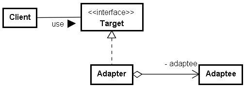
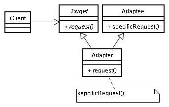
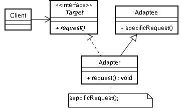
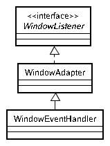
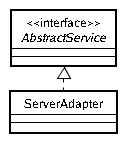

# Adapter 模式

物件之間溝通時介面的不匹配時有所見，也許您有開發應用程式的過程中已設計了一些方法供某些公開協定的物件使用，您打算引入了先前開發過的類別，或者是第三方的類別，但很常發現到它們之間的公開介介面並不一致。

舉個例子來說，在 JDK5 之後有了個新的 foreach 語法，預設如果是個陣列或 Collection 物件，則可以這麼使用：

```java
List<String> list = new ArrayList<String>();
for(String s : list) {
    System.out.println(s);
}
```

事實上， JDK5 所引入的 foreach 語法，只要是有實作 java.lang.lterable 介面的物件，就可以套用， java.lang.lterable 是在 JDK5 之後新增的介面：

```java
package java.lang;
public interface Iterable<T> {
    Iterator<T> iterator();
}
```

foreach 語法可以簡化程式的撰寫，如果你有個類別，想要能夠參與 foreach 語法，但本身法有實作 Iterable 介面該如何？例如您想要 String 也可以用 foreach 語法逐一取出字元的話，那麼您可以使用以下類似的作法：

```java
import java.util.*;

class IterableString implements Iterable<Character> {
    private String str;
    IterableString(String str) {
        this.str = str;
    }
    public Iterator<Character> iterator() {
        return new Iterator<Character>() {
                   private int index;
                   public boolean hasNext() {
                       return index < str.length();
                   }
                   public Character next() {
                       return str.charAt(index++);
                   }
                   public void remove() {
                       throw new RuntimeException("Not supported");
                   }
               };
    }
}

public class Main {
    public static void main(String[] args) throws Exception {
         String original = new String("I like foreach!");
         for(char c : new IterableString(original)) {
             System.out.println(c);
         }
    }
}
```

這是 Object Adapter 模式的一個實現，以類別圖來表示 Object Adapter 模式的話：



就下例而言， Iterable 就是 Target 角色， String 就是 Adaptee 的角色， IterableString 就是 Adapter 的角色。

如果使用 Python 正式地實現 Object Adapter ，則可以像以下的實作方式：

```python
class Adaptee:
    def doAction(self):
        return 'Adaptee'

class Adapter:
    def __init__(self, adaptee):
        self.adaptee = adaptee

    def request(self):
        return self.adaptee.doAction()

def printIt(x):
    print(x.request())

client = Adapter(Adaptee())
printIt(client)
```

由於 Python 可以動態地為類別添加屬性，即使是未添加屬性前就已建立的物件，在類別動態添加屬性之後，也可依 Python 的名稱空間搜尋順序套用上新的屬性，用這種方式，您可以為 Adaptee 動態地添加公開介面，例如：

```python
class Adaptee:
    def doAction(self):
        return 'Adaptee'

def printIt(x):
    print(x.request())

client = Adaptee()
Adaptee.request = lambda self : self.doAction()

printIt(client)
```

雖然實現的方式有點巧妙，不過這也是 Object Adapter 的實現，只不過在添加的方法中包裏原物件的操作。

---

簡單地說， Object Adapter 這種方法在 Python 中可以用 lambda 來替代。

---

Adapter 模式的另一種作法是 Class Adapter 模式，這個模式主要運用多重繼承，讓 Adapter 繼承想要引入的 Adaptee 類別以獲得其介面，並繼承 Target 以獲得想要使用之介面。



這個模式主要適用於支援多種繼承之介面， Adaptee 可能不只一個，如 C++ 、 Python ，如果是 Python ，一個實現的方式如下：

```python
class Adaptee1:
    def doAction1(self):
        print("action 1")

class Adaptee2:
    def doAction2(self):
        print("action 2")

class Adaptor(Adaptee1, Adaptee2):
    def doRequest(self): # doRequest 是期望之介面
        self.doAction1()
        self.doAction2()
        print("request")

adaptor = Adaptor()
adaptor.doRequest()
```

對於支援多重繼承的語言來說，這種方式自然且簡潔，但對於只支援單一繼承的語言則無法直接套用，例如在 Java 中若要採用 Class Adapter ，必須作點修改，一方面繼承 Adaptee ，一方面實作 Target 的介面：



若使用 Java 的話，程式碼的實作是這樣：

```java
public class Adapter extends Adaptee implements Target {
    public void request() {
        specificRequest();
    }
}
```

不過，顯然的有些限制， Adapter 仍舊只能繼承一個 Adaptee ，若有多個 Adaptee 想要引進，這個修改就仍不適合，再著在單一繼承下 is a 的關係更為強烈，採用這種方式引入 Adaptee ，意謂著您的 Adapter 是一種 Adaptee ，所以 Class Adapter 在 Java 中適用的場合較少，事實上，若僅是在這個修改中引用 Adaptee 的公開介面，會比較建議改用 Object  Adapter ，因為 Object Adapter 模式比較有彈性，例如，您可以在 Adapter 上加上個 setter ，以隨時可以抽換 Adaptee ，您也可以在一個 Object Adapter 中擁有多個 Adaptee 實例。

也許您會在 Java 中使用 Class Adapter 的時機，在於 Adaptee 的公開介面無法組合出您想要的功能時，您會希望繼承 Adaptee 後直接使用其內部資料或方法來實作 Target 的介面，不過這顯然前題是，那些您想觸及的內部資料或方法必須是 proteted 的，依舊有所限制。

---

在 Java 中如果要定義事件處理的方式，必須實作 EventListener 的子介面，例如實作 WindowListener 來定義一些視窗事作的處理方式， WindowListener 中定義了七個方法：

```java
 public interface WindowListener extends EventListener {
    public void windowOpened(WindowEvent e);
    public void windowClosing(WindowEvent e);
    public void windowClosed(WindowEvent e);
    public void windowIconified(WindowEvent e);
    public void windowDeiconified(WindowEvent e);
    public void windowActivated(WindowEvent e);
    public void windowDecativated(WindowEvent e);
}
```

可以定義一個類別來實作這個介面，以完全想要的事件處理，例如：

```java
public class WindowEventHandler implements WindowListener {
    public void windowOpened(WindowEvent e) {}
    public void windowClosing(WindowEvent e) {}

    public void windowClosed(WindowEvent e) {
        System.exit(0);
    }

    public void windowIconified(WindowEvent e) {}
    public void windowDeiconified(WindowEvent e) {}
    public void windowActivated(WindowEvent e) {}
    public void windowDecativated(WindowEvent e) {}
}
```

然而這有個缺點，實作介面的原則是您必須實作當中所定義的所有方法，即使您對某些事件並不感興趣，您也必須實作一個沒有內容的空方法，代表您已經實作了介面中定義的方法，然而有時，您並不知道介面中到底定義了幾個方法，或是知道也不知道方法的確切名稱與參數，即使您查了 API ，在程式中寫下一堆沒有實作內容的方法也是很煩人的一件事。

WindowAdapter 類別預先實作了 WindowListener 介面，每個方法中都是空的實作，如下所示：

```java
public abstract class WindowAdapter 
                         implements WindowListener {
    public void windowOpened(WindowEvent e) {}
    public void windowClosing(WindowEvent e) {}
    public void windowClosed(WindowEvent e) {}
    public void windowIconified(WindowEvent e) {}
    public void windowDeiconified(WindowEvent e) {}
    public void windowActivated(WindowEvent e) {}
    public void windowDecativated(WindowEvent e) {}
}
```

可以繼承 WindowAdapter 類別，並重新定義一些您所感興趣的事作，如此一來，就可以避開之前所提及的，直接實作 WindowListener 介面的缺點，如下所示：

```java
public class WindowEventHandler extends WindowAdapter {
    public void windowClosed(WindowEvent e) {
        System.exit(0);
    }
}
```

這就是 Default Adapter 模式，它使用一個中介的 Adapter 類別來將真正感興趣的事件實作類別，配接至事件處理介面，上面的程式其 UML 圖如下：



將上圖一般化， Default Adapter 模式的結構如下所示：



像 Python 這類的動態語言，沒有 Java 的 interface 這種機制來規範一個類別所需實作的介面，遵循物件之間的協定基本上是開發人員的自我約束（當然，還得有適當的說明文件）。這邊可以反過來思考一下，如果你非得有個方式，強制實現某個公開協定，那該怎麼作？

可以類似這樣的寫法：

```python
class XDListener:
    def action(self):
        assert 0, 'action not implemented'

class Orz(XDListener):
    def action(self):
        print("XD")

orz = Orz()
orz.action()
```

或者引發內建的 NotlmplementedError：

```python
class XDListener:
    def action(self):
        raise NotImplementedError("action not implemented")

class Orz(XDListener):
    def action(self):
        print("XD")

orz = Orz()
orz.action()
```

這樣的方式，在類別沒有重新定義指定方法時，至少在執行時期可以引起開發人員的注意，告訴他非得實作某個方法才行，如果你還想要進一步阻止 XDListener 的例化，則可以這麼實作：

```python
class XDListener:
    def __new__(clz):
        raise NotImplementedError('Could not instantiate abstract ' + str(clz))
        
    def action(self):
        raise NotImplementedError("action not implemented")
```

上例中，如果您試圖實例化 XDListener ，則會引發錯誤。或者你可以更進步使用 Python 的特性：

```python
from abc import ABCMeta, abstractmethod

class XDListener(metaclass=ABCMeta):
    @abstractmethod
    def action(self):
        pass

class Orz(XDListener):
    def action(self):
        print("XD")
        
orz = Orz()
orz.action()
```

上例中，如果試圖實例化 XDListener，則會發生 TypeError：

**TypeError: Can't instantiate abstract class XDListener with abstract methods action**

或者是子類別沒有實作所有被 `@abstractmethod` 修飾的方法，也會引發 TypeError 。例如若未實作 `action()` 的話：

**TypeError: Can't instantiate abstract class Orz with abstract methods action**

---

Default Adapter 簡單來講就是 Adapter 的一種變型，為了使實作更簡單而產生的一種型式。

http://openhome.cc/Gossip/DesignPattern/AdapterPattern.htm

http://openhome.cc/Gossip/DesignPattern/AdapterPattern2.htm

http://openhome.cc/Gossip/DesignPattern/DefaultAdapter.htm