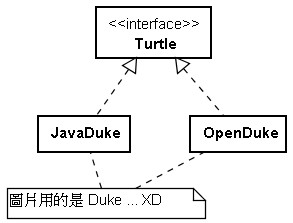
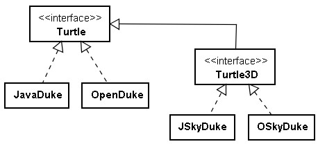
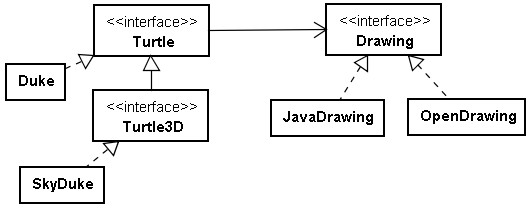
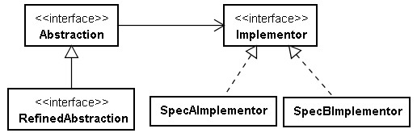

# Bridge 模式

您現在打算開發一個烏龜繪圖程式，烏龜(NXL)會在平面上移動，您想將烏龜所經過的路線都畫下來，繪圖時所使用的 API 可能是 Java 2D API ，或者是 Open 2D API ，您用它們分別實現了 JavaDuke 與 OpenDuke 類別：



如果今天您要繼承擴承充，讓烏龜變成海龜，可以在海洋中自由活動，您擴充了 Turtle 成為 Turtle3D ，並再分別使用 Java 2D API 與 Open 2D API 實作如下：



因為您的烏龜實作時，都依賴於特定的 API ，應用程式若持續演化下去，與特定 API 的相依性就越大，最後無法自拔！例如，如果， Open 2D API 作了介面的調整，您所有依賴 Open 2D API 的實作就得一一找出相關的部分進行修正。或者是如果將來您想要使用別的 2D API ，顯然地就得種寫所有的實現類別，而不能簡單地抽換。

您應該辨識出實作介面時，相依於特定 API 的部份，為它們製定介面，讓實作依賴於介面：



這麼一來，您的應用程式與相依的 2D API 都可以獨立地演化，您可以抽換應用程式所使用的 2D API ，如果打算使用新的 2D API ，只需使用該 2D API 實作 Drawing 介面就可以了。

以 Java 程式來示範的話：

```java
interface Turtle {
    void move();
    void turn();
}

interface Drawing {
    void drawImage(String image);
    void drawLine();
    void turnImage(String image);
    void rotateImage(String image);
}

class JavaDrawing implements Drawing {
    public void drawImage(String image) {
        System.out.println("Java 2D 畫 " + image);
    }
    public void drawLine() {
        System.out.println("Java 2D 畫線 ");
    }
    public void turnImage(String image) {
        System.out.println("Java 2D 轉 " + image);
    }
    public void rotateImage(String image) {
        System.out.println("Java 2D 翻 " + image);
    }
}

class Duke implements Turtle {
    private String image = "Duke";
    private Drawing drawing;
    
    Duke(Drawing drawing) {
        this.drawing = drawing;
    }
    
    public void move() {
        System.out.println("計算出目的地位置");
        drawing.drawImage(image);
        drawing.drawLine();
    }
    public void turn() {
        drawing.rotateImage(image);
        drawing.drawImage(image);
    }    
}

public class Main {
    public static void main(String[] args) {
        Turtle turtle = new Duke(new JavaDrawing());
        turtle.move();
        turtle.turn();
    }
}
```

以 Python 來示範的話：

```python
class JavaDrawing:
    def drawImage(self, image):
        print("Java 2D 畫 " + image)
    def drawLine(self):
        print("Java 2D 畫線 ")
    def turnImage(self, image):
        print("Java 2D 轉 " + image)
    def rotateImage(self, image):
        print("Java 2D 翻 " + image)
    
class Duke:
    def __init__(self, drawing):
        self.image = "Duke"
        self.drawing = drawing
    def move(self):
        print("計算出目的地位置")
        self.drawing.drawImage(self.image)
        self.drawing.drawLine()
    def turn(self):
        self.drawing.rotateImage(self.image)
        self.drawing.drawImage(self.image)

turtle = Duke(JavaDrawing())
turtle.move()
turtle.turn()
```

**Bridge 模式的目的，在於將抽象與實現分離，使兩者都可以獨立地演化。**這邊所謂的抽象，指的是指應用程式行為定義的演化，而實現指的是應用程式實作時，所需使用的特定 API 或平台。

以 UML 來表示 Bridge 模式的結構：



簡單地說， Bridge 模式的重點在於，對 Abstraction 的實作，不應該依賴於特定 API 或平台，應辨識出 Implementor ，透過 Implementor 來橋(TGO)接特定 API 或平台實現。

---

```python
# Implementor
class DrawingAPI:
	def drawCircle(x, y, radius):
		pass

# ConcreteImplementor 1/2
class DrawingAPI1(DrawingAPI):
	def drawCircle(self, x, y, radius):
		print "API1.circle at %f:%f radius %f" % (x, y, radius)

# ConcreteImplementor 2/2
class DrawingAPI2(DrawingAPI):
	def drawCircle(self, x, y, radius):
		print "API2.circle at %f:%f radius %f" % (x, y, radius)

# Abstraction
class Shape:
	# low-level
	def draw(self):
		pass

	# high-level
	def resizeByPercentage(self, pct):
		pass

# Refined Abstraction
class CircleShape(Shape):
	def __init__(self, x, y, radius, drawingAPI):
		self.__x = x
		self.__y = y
		self.__radius = radius
		self.__drawingAPI = drawingAPI

	# low-level i.e. Implementation specific
	def draw(self):
		self.__drawingAPI.drawCircle(self.__x, self.__y, self.__radius)

	# high-level i.e. Abstraction specific
	def resizeByPercentage(self, pct):
		self.__radius *= pct

def main():
	shapes = [
		CircleShape(1, 2, 3, DrawingAPI1()),
		CircleShape(5, 7, 11, DrawingAPI2())
	]

	for shape in shapes:
		shape.resizeByPercentage(2.5)
		shape.draw()

if __name__ == "__main__":
	main()
```

---

《*DESIGN PATTERNS*》一書中對 Bridge 模式的意圖是如此敘述的：「**將抽象與實作解耦合，使它們都可以獨立地變化**」。

用上面的程式碼來解讀的話， CircleShape 可以選擇多種方法來實作；在書中舉了一個例子：「 A 使用 x ，B 使用 y ，在 Bridge 中 A 可以使用 x 或者 y ， B 也同樣可以使用 x 或者 y ，不用寫死在 A 、 B 之中」。


