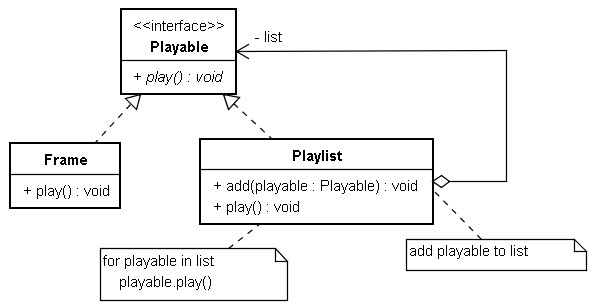
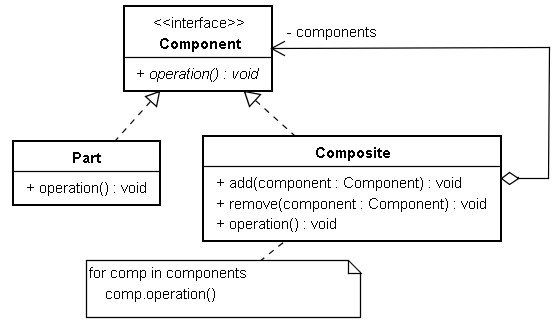
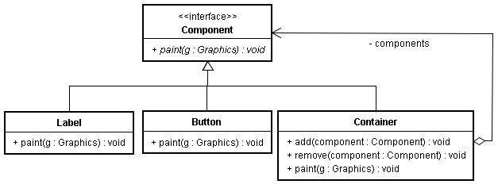

# Composite 模式

假設您今天要開發一圈動畫編輯程式，動畫由影格（Frame）組成，數個影格組合為動畫清單，動畫清單也可以由其它已完成的動畫清單組成，也可以在動畫清單與清單之間加入個別影格。

無論是影格或動畫清單都可以播放，而動畫清單負責的就是組合影格或動畫清單，所以可以這麼設計：



對於 Frame 而言， Playlist 是一個容器，然而 Playlist 也實作 Playable ，所以它也可以播放，您可以進一步地將 Playlist 組合至另一個 Playlist 中，以形成更長的播放清單。

以 Java 實現的話。

```java
import java.util.*;

interface Playable {
    void play();
}

class Frame implements Playable {
    private String image;
    Frame(String image) {
        this.image = image;
    }
    public void play() {
        System.out.println("播放 " + image);
    }
}

class Playlist implements Playable {
    private List<Playable> list = new ArrayList<Playable>();
    public void add(Playable playable) {
        list.add(playable);
    }
    public void play() {
        for(Playable playable : list) {
            playable.play();
        }
    }
}

public class Main {
    public static void main(String[] args) {
        Frame logo = new Frame("片頭 LOGO");
        
        Playlist playlist1 = new Playlist();
        playlist1.add(new Frame("Duke 左揮手"));
        playlist1.add(new Frame("Duke 右揮手"));
        
        Playlist playlist2 = new Playlist();
        playlist2.add(new Frame("Duke 走左腳"));
        playlist2.add(new Frame("Duke 走右腳"));
        
        Playlist all = new Playlist();
        all.add(logo);
        all.add(playlist1);
        all.add(playlist2);
        
        all.play();
    }
}
```

以 Python 實現的話：

```python
class Frame:
    def __init__(self, image):
        self.image = image
    def play(self):
        print("播放 " + self.image)

class Playlist:
    def __init__(self):
        self.list = []
    def add(self, playable):
        self.list.append(playable);
    def play(self):
        for playable in self.list:
            playable.play()
            
logo = Frame("片頭 LOGO")
        
playlist1 = Playlist()
playlist1.add(Frame("Duke 左揮手"))
playlist1.add(Frame("Duke 右揮手"))
        
playlist2 = Playlist()
playlist2.add(Frame("Duke 走左腳"))
playlist2.add(Frame("Duke 走右腳"))
        
all = Playlist()
all.add(logo)
all.add(playlist1)
all.add(playlist2)

all.play()
```

以 UML 來表示 Composite 模式的結構：



具有層次性或組合性的物件可以使用 Composite 模式，像是電路元件、視窗元件等，使用 Composite 模式可以大大減低這些元件設計的複雜度，以 Java 標準 API 中 AWT 視窗元件為例， Composite 上有個 `paint()` 方法，可以進行元件的繪製， Container 可以容納 Component （如 Button 、 Label 等），而 Container 繼承 Component ，所以 Container 也可以容納 Container ，這也是 Composite 模式的實際例子：



---

