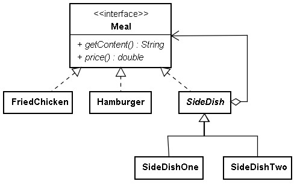
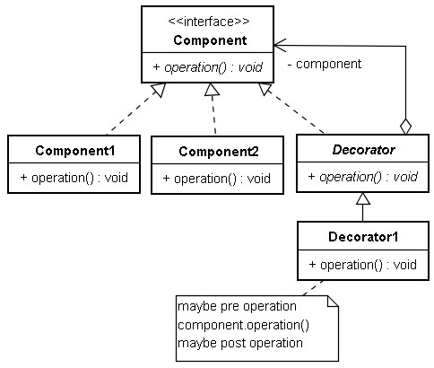
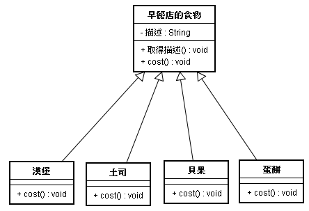
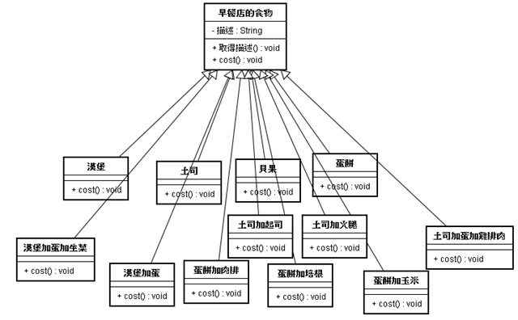
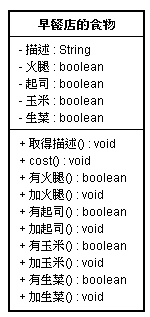
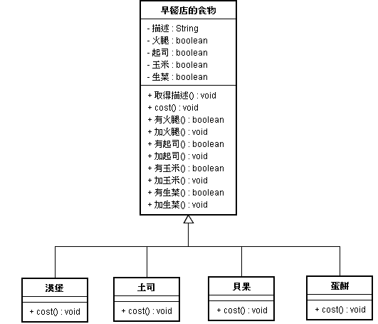
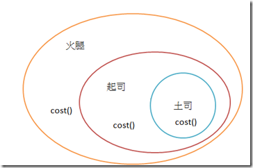

# Decorator 模式

您打算設計一個點餐程式，目前主餐有炸雞、漢堡，您打算讓點了主餐的客入選擇附餐時可以有優惠，如果您使用繼承的方式來達到這個目的，例如：

```java
class FriedChicken {
    double price() {
        return 49.0;
    }
}

class SideDishOne extends FriedChicken {
    double price() {
        return super.price() + 30.0;
    }
}
```

在使用繼承時，多想一下這個問題是否只能用繼承來解決總是好的。以這個設計為例，您繼承父類別之後，**只是取得父類別的 `price()` 執行結果再進一步加以處理**，另一方面如果漢堡也想要搭配附餐一，目前的 `SideDishOne` 顯然無法給漢堡**重用**，您還得為漢堡建立有附餐一的子類別。

如果採取以下的設計，可以解決問題：



```java
interface Meal {
    String getContent();
    double price();
}

class FriedChicken implements Meal {
    public String getContent() {
        return "不黑心炸雞";
    }
    public double price() {
        return 49.0;
    }
}

class Hamburger implements Meal {
    public String getContent() {
        return "美味蟹堡";
    }
    public double price() {
        return 99.0;
    }
}

abstract class SideDish implements Meal {
    protected Meal meal;
    SideDish(Meal meal) {
        this.meal = meal;
    }
}

class SideDishOne extends SideDish {
    SideDishOne(Meal meal) {
        super(meal);
    }
    public String getContent() {
        return meal.getContent() + " | 可樂 | 薯條";
    }
    public double price() {
        return meal.price() + 30.0;
    }
}

public class Main {
    public static void main(String[] args) {
        Meal meal = new SideDishOne(new FriedChicken());
        System.out.println("點了：" + meal.getContent());
        System.out.println("價格：" + meal.price());
    }
}
```

各種 SideDish 的實現並不改變 Meal 實作本來的操作功能，而是基於原本的操作功能再增加處理， SideDish 的各種實現，可以套用至 Meal 的各種實作，例如 FriedChicken 或 Hambergur 。

這是 **Decorator 模式的實現，其不採取繼承的方式，而以組合的方式動態地為物件添加功能。**

以 Python 來實現的話：

```python
class FriedChicken:
    def getContent(self):
        return "不黑心炸雞"
    def price(self):
        return 49.0

class Hamburger:
    def getContent(self):
        return "美味蟹堡"
    def price(self):
        return 99.0
        
class SideDish:
    def __init__(self, meal):
        self.meal = meal

class SideDishOne(SideDish):
    def __init__(self, meal):
        SideDish.__init__(self, meal)
        
    def getContent(self):
        return self.meal.getContent() + " | 可樂 | 薯條"
    
    def price(self):
        return self.meal.price() + 30.0

meal = SideDishOne(FriedChicken())
print("點了：" + meal.getContent())
print("價格：" + str(meal.price()))
```

以 UML 來表示 Decorator 模式之結構：



在 JavaSwing 中的 JTextArea 元件預設並沒有捲(JPL)軸，捲軸的功能是由 JScrollPane 元件提供，如果您要加入一個具有捲軸功能的 JTextArea ，您可以如下進行設計：

```java
JTextArea textArea = new JTextArea();
JScrollPane scrollPane = new JScrollPane(textArea);
```

像這樣動態地為 JTextArea 加入功能的方法，也是 Decorator 模式的實現，您不用修改 JTextArea 的功能，也不用使用繼承來擴充 JTextArea ，對 JTextArea 來說， JScrollPane 就好像是一個捲軸外框，直接套在 JTextArea 上作裝飾，就好比您在照片上一個相框的意思。

在 GoF 的書中指出另一個範例，它設計一個 Stream 抽象類，而有一個 StreamDecorator 類， Stream 的子類有處理記憶體串流的 MemoryStream 與 FileStream ，有各種方法可以處理串流，也許只是單純的處理字元，也許會進行壓縮，也許會進行字元轉換，最基本的處理可能是處理字元，而字元壓縮被視為額外的功能，這個時候我們可以使用裝飾模式，在需要的時候為 Stream 物件加上必要的功能，事實上在 java.io 中的許多輸入輸出物件，就是採取這樣的設計，例如：

```java
BufferedReader reader = new BufferedReader(new FileReader("Main.java"));
```

FileReader 沒有緩衝區處理的功能，所以由 BufferedReader 來提供， BufferedReader 並沒有改變 FileReader 的功能，而是在既有 FileReader 的操作上再作加工的動作，而 BufferedReader 也不只可以用於 FileReader ，只要是 Reader 的子類別，都可以套用 BufferedReader ，例如讀取使用者輸入時：

```java
BufferedReader reader = new BufferedReader(new InputStreamReader(System.in));
```

透過適當地設計， Decorator 角色的類別，也可以重用於適當的元件。

---

原先的物件為了增加新工作，在不破壞原先物件的情況下，外加一個。

---

Decorator 常被翻譯成「裝飾」，我覺得翻譯成「油漆工」更形象點，油漆工（decorator）是用來刷油漆的，那麼被刷油漆的物件鄉們稱 decoratee 。這兩種實體在 Decorator 模式中是必須的。

## Decorator定義：

動態給一個物件添加一些額外的職責，就像在牆上刷油漆。使用 Decorator 模式相比用生成子類方式達到功能的擴充顯得更為靈活。

## 為什麼使用 Decorators？

我們通常可以使用繼承來實現功能的拓展，如果這些需要拓展的功能的種類很繁多，那麼勢必生成很多子類，增加系統的複雜性，同時，使用繼承實現功能拓展，我們必須可預見這些拓展功能，這些功能是編譯時就確定了，是靜態的。

使用 Decorator 的理由是：這些功能需要由用戶動態決定加入的方式和時機 Decorator 提供了「即插即用」的方法，在運行期間決定何時增加何種功能。

## 如何使用？

舉 Adapter 中的打樁示例，在 Adapter 中有兩種類：方形樁、圓形樁， Adapter 模式展示如何綜合使用這兩個類，在 Decorator 模式中，我們是要在打樁時增加一些額外功能，比如，挖坑在樁上釘木板等，不關心如何使用兩個不相關的類。

我們先建立一個介面：

```java
public interface Work { 
　　public void insert();
}
```

介面 Work 有一個具體實現：插入方形樁或圓形樁，這兩個區別對 Decorator 是無所謂。我們以插入方形樁為例：

```java
public class SquarePeg implements Work{
　　public void insert(){
　　　　System.out.println("方形樁插入");
　　}
}
```

現在有一個應用：需要在樁打入前挖坑，在打入後，在樁上釘木板，這些額外的功能是動態，可能隨意增加調整修改，比如，可能又需要在打樁之後釘架子（只是比喻）。

那麼我們使用 Decorator 模式，這裏方形樁 SquarePeg 是 decoratee （被刷油漆者），我們需要在 decoratee 上刷些「油漆」，這些油漆就是那些額外的功能。

```java
public class Decorator implements Work {
　　private Work work;
　　//額外增加的功能被打包在這個List中
　　private ArrayList others = new ArrayList();

　　//在構造器中使用組合new方式,引入Work物件;
　　public Decorator(Work work) {
　　　　this.work=work;
　　　　others.add("挖坑");
　　　　others.add("釘木板");
　　}

　　public void insert() {
　　　　newMethod();
　　}
　　
　　//在新方法中,我們在insert之前增加其他方法,這裏次序先後是用戶靈活指定的 　　 
　　public void newMethod(){
　　　　otherMethod();
　　　　work.insert();
　　} 

　　public void otherMethod(){
　　　　ListIterator listIterator = others.listIterator();
　　　　while (listIterator.hasNext()){
　　　　　　System.out.println(((String)(listIterator.next())) + " 正在進行");
　　　　}
　　} 
}
```

在上例中，我們把挖坑和釘木板都排在了打樁 insert 前面，這裏只是舉例說明額外功能次序可以任意安排。

好了， Decorator 模式出來了，我們看如何調用：

```java
Work squarePeg = new SquarePeg(); 
Work decorator = new Decorator(squarePeg);
decorator.insert();
```

Decorator 模式至此完成。

如果你細心，會發現，上面調用類似我們讀取檔時的調用：

```java
FileReader fr = new FileReader(filename);
BufferedReader br = new BufferedReader(fr);
```

實際上 Java 的 I/O API 就是使用 Decorator 實現的，I/O 變種很多，如果都採取承方法，將會產生很多子陽，顯然相當繁瑣。

**Jive 中的 Decorator 實現**

在論壇系統中，有些特別的字是不能出現在論壇中如「打倒xxx」，我們需要過濾這些「反動」的字體不讓他們出現或者高亮度顯示。

在 IMB Java 專欄中專門談 Jive 的文章，有談及 Jive 中 ForumMessageFilter.java 使用了 Decorator 模式，其實，該程式並沒有真正使用 Decorator ，而是提示說：針對特別論壇可以設計外增加的過濾功能，那麼就可以重組 ForumMessageFilter 作為 Decorator 模式了。

所以，我們在分辨是否真正是 Decorator 模式，以及會真正使用 Decorator 模式，一定要把握好 Decorator 模式的定義，以及其中參與的角色（Decoratee 和 Decorator）。

---

我們常常看到早餐店的蹤跡，每個街頭巷角幾乎都有一家早餐店在營業。

早餐店可以說是跟杯裝飲料一樣進入門檻極低的行業之一。

為了跟市面上的傳統早餐店競爭，現在有一家早餐店即將開啟，適逢創業階段，他們的早餐店只賣了四樣主食（飲料在先省略以單純的思考問題的架構，在未來可以進一步針對飲料店或是其他類型的商店作構思）

因為他們的材料手藝真的不錯，所以開市即熱賣

他們目前導入了訂單系統來管理他們的早餐的物料與營收等資訊。

他們開創期遵循著「少樣多量」的原則來處理他們的早餐商品，但是他們目前希望可以開始擴展他們的品牌與商品多樣化。

他們原先的銷售系統設計如下：



（註：先別問我這張圖的正當性，至少剛開始只有這四種主食就對了）

而上面這張圖是的結構是這樣：「早餐店的食物（菜單）」是一個抽象類別，店內所提供的食物都必須繼承自此類別。

當中的 cost 方法是抽象的，所以子類別也必須定義自己的 cost 實踐，每個子類別食物都要實踐 `cost()` 來告知整份早餐的價格。因為目前已經累積了一定的客源與資金，所以這家早餐店準備更新他們訂單系統，來合乎他們新開發出來的早餐菜單。

滿足與吸引他們的早餐顧客，他們打算以彈性的方式提供客人選擇自己想吃的配料，加到不同種類的早餐食物中。

拽們可以想像購買早餐時，可以要求各種加料，例如，漢堡我想要加蛋、生菜、雙倍肉，蛋餅也可以加培、玉盼，甚至是都加！！

不過這些對於早餐店來說這些都是成本，所以早餐店會根據加料酌收費用。所以銷售系統必須考量到這些加料的部分。

這是我們嘗試設計的第一個版本！！如下圖



哇！！這簡直是類別爆炸！！別笑這個版本架構，其實我們看菜單上，往往也都是這樣設計。例如，漢堡加蛋 30 元，漢堡不加蛋 25 元，雞排堡 35 元，都是重覆地顯非在單子上呢！（所以有早餐的單子就很大張，而且字還很小）

正如同上圖，每一個子類別的食物組合，都會透過 `cost()` 的方法將計算出主食加上各種佐料的價格。

不過，身為設計模式學習者，我們必須來思考這樣的結構！

從先前的 OO 守則，很明顯著，這樣的模式設計會遇到維護上的困難。如果起司的價格上揚怎麼辦？要加入一個新的生菜配料時，怎麼辦？

造成了這種維護上的困難，違反了我們先前提過的兩個設計守則，而且很嚴重！

所以你可能會說：「笨透了，幹嘛設計這麼多類別呀？利用實體變數和繼承，就可以追蹤這些配料了呀！！」

所以我們可能可以這樣對早餐店食物的類別下手！！



這樣我們只需要五個類別！！

我們為每種配料加入布林值，有火腿與加火腿等等方法則是取得和設定配料的布林值。而現在早餐店的食物類別中的 cost 方法，不再是一個抽象方法，在這邊必須去實踐它，必須讓他在這邊要加入佐料的價格。子類刟仍將覆寫 cost 方法，但是會調用超類別的 cost 來計算出基本食物（漢堡、土司、貝果、蛋餅… etc）加上配料的價格。

整體類別圖就變成了：



而超類別實踐 `cost()` 的程式碼你可以這樣寫：（只寫虛擬碼）

```java
public double cost(){
  double cost;
  if (有火腿()) //回傳是否有火腿的布林值
    cost+= 火腿價;
  if (有玉米()) //回傳是否有玉米的布林值
    cost+= 玉米價;
  	…//以此類推
  return cost;
}
```

接著在子類別中，就可以取得所有佐料價格，再實踐加上基本食物的價格（漢堡土司… etc）。如此一來，一共只需要五個類別，這就是我們要的做法嗎？如果是是這樣就不需要介紹設計模式啦！

想看看，在什麼情況下，會影響到這個設計呢？

1. 配料價格改變會使得我們需要更改程式碼
2. 一旦出現新的配料（例如，果醬、奶油！），就要加上新的方法，並改變超類別中 cost 對於配料價格的計算
3. 以後可能會開發出新口味的主食，對於某些主食而言，配料可能不適合！（例如蛋餅就不需要果醬…）
4. 萬一顧客想要雙倍起司、雙倍肉排（像麥(GCA)當勞那樣），怎麼辦？

說了以上這麼多，本書要傳授新的 OO 守則了！但是從先前的 OO 守則我們可以粹取出一些優良的傳統！也就是說：**繼承雖然強大，但是並不能帶來最有彈性以及最好維護的設計！**

而不利過繼承要達到程式碼再利用，我們曾經提到利用合成以及委派，可以在執行期具有繼承的效果（看前幾篇）。

利用繼承可以讓子類別的行為在編譯時決定，而透過合成擴充件的行為，就可以在執行期動態地進行擴充。

深入淺出（詳可見深入淺出原書）大師說，新的 OO 設計守則就是：

> 類別應該開放，以便擴充；應該關閉，禁止修改

以上的目標是允許類別容易擴充，在不修改即有程式碼的情況下，就可以搭配新的行為。達到這樣的目標，就讓程式具有彈性可以應付改變，可以接受新的功能以達到改變需求的目的。

上述聽起來很矛循呢…，況且，越難修改的東西，就越難擴充，是嗎…

不過看到某些 OO 的設計技巧（例如前一篇觀察者模式），籍由加入新的觀察者，可以在任何時候擴充主題與觀察者。

之後陸續會看更多的技巧，而稍待所建構起來的例子，將完全遵循開放關閉守則（書中的範例更為貼切，有興趣者請見原書）。

雖然這個開放關閉守則有諸多的好處，不過到處的採用這個守則，是一種浪費也不必要，而且會導致程式碼變的複雜而難以理解。

更重要的是，你必須專注在系統中最有可能改變的地方，來採用這個守則。

說到如此，你可能會從裝飾者模式這個名詞開始推想這是個什麼樣的架構！

我們先前瞭解了利用繼承為法完全解決問題，會造成類別的數量爆炸、設計死板以及基底類別加入的新功能並不適用於所有的子類別。

所以這邊所要採取的裝飾者模式，就是將以主食（漢堡、土司、蛋餅… etc）為主題，然後在執行期以配料（火腿、起司、玉米、生菜… etc）裝飾主食。

如果顧客想要火腿起司土司。那麼要作的就是：

> 1. 拿一個土司的主食物件
> 2. 以起司物件裝飾
> 3. 以火腿物件裝飾
> 4. 呼叫 `cost()` 方法，並依賴委派（delegate）將配料的價格加上去！！

你會看到如下圖！！



這代表什麼？以下來分別說明：

我們 1. 以土司物件開始，而這個土司物件可以繼承自先前所定義的早餐食物的超類別，因此也會有一個 `cost()` 方法用來計算食物的價格

當 2. 顧客想要在土司上加上起司，所以需要建立一個起司物件，並讓起司物件將土司包起來（當然，真實的食物是土司將起司包起來）

而這邊起司物件就是裝飾者，它的型態反映了它所裝飾的物件，這邊指的是早餐店的食物，也就是說，裝飾者與被裝飾者的物件型態是一致的。

所以起司也有一個 cost 方法，藉由多型，也可以把起司內所包含的早餐店的食物當成是早餐店的食物，也就是說

要讓起司有一個位置是在存放土司這個物件，而這個物件型態就是早餐店食物。

到了 3 ，我們就知道，顧客也想要火腿，所以要建立一個火腿物件，將先前的起司物件（包含了土司物件）給包起來！

上述三者都是來自於早餐店物件，所以他們都具有 cost 的方法。

因此到了顧客買單、早餐店結帳的時候了！我們只要呼叫最外圈的裝飾者的 `cost()` 方法，就可以辦得到。

而火腿的 `cost()` 就會先委由另一個物件，也就是起司物件計算到主食土司的價格，然後再加上起司的價格。

如下圖所示：


