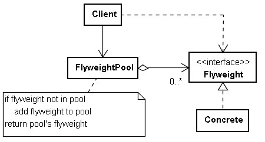

# Flyweight 模式

您現在打算建立一個文書處理程式，文件中的文字可以設置字型資訊，也許您是這麼設定一段文字的字型資訊：

```java
text.setFont(new Font("細明體", Style.BoLD, 12));
```

文書處理程式中的文字都會有字型資訊，但可能有一些字型資訊是重複的，例如有些文字都是細明體、粗體、大小 12 的字型，有些文字都是標楷體、斜體、大小 16 的字型，對於同同樣字型資訊的文字，卻每次都用新建字型物件的方式來設定，雖然是小物件，但數量多的話，也有可能佔用相當的記憶體。

對於小且可以資訊重複的物件，可以考慮共用，例如：

```java
import java.util.*;
import java.lang.ref.*;

interface Style {
    final static int PLAIN = 1;
    final static int BOLD = 2;
    final static int ITALIC = 3;
}

class Font {
    final String name;
    final int style;
    final int size;
    
    Font(String name, int style, int size) {
        this.name = name;
        this.style = style;
        this.size = size;
    }
    
    public boolean equals(Object other) {
        if (other instanceof Font) {
            if (other == this) {
                return true;
            }
            Font font = (Font) other;
            return font.style == style 
                   && font.size == size
                   && font.name.equals(this.name);
        }
        return false;
        
    }
    public int hashCode() {
        return (style * 37 + size * 13) * name.hashCode();
    }
}

class FontFactory {
    private static Map<Font, WeakReference<Font>> flyweights =
        new WeakHashMap<Font, WeakReference<Font>>();
       
    static Font create(String name, int style, int size) {
        Font font = new Font(name, style, size);
        if(!flyweights.containsKey(font)) {
            flyweights.put(font, new WeakReference<Font>(font));
        }
        return flyweights.get(font).get();
    }
}

public class Main {
    public static void main(String[] args) {
        Font font1 = FontFactory.create("細明體", Style.BOLD, 12);
        Font font2 = FontFactory.create("細明體", Style.BOLD, 12);
        System.out.println(font1 == font2);
    }
}
```

在這邊搭配了 Simple Factory 模式，隱藏了 Font 建立的細節，最主要是如何共用物件以節省記憶體的使用量，您可以只簡單地使用 HashMap ，不讓重複資訊的物件佔用記體， 而範程式中則進一步使用了 WeakHashMap ，這是 Java 所提供的 Map 實現，可以在記憶體量不足時，主動釋放未被程式其它部份參考的物件。

如果是 Python 實現的話，以下是個簡單示範：

```python
import weakref

class Style:
    PLAIN = 1
    BOLD = 2
    ITALIC = 3

class Font:
    def __init__(self, name, style, size):
        self.name = name
        self.style = style
        self.size = size
    def __repr__(self):
        return repr(self.name) + repr(self.style) + repr(self.size)

class FontFactory:
    __flyweight = weakref.WeakValueDictionary()
    
    def create(name, style, size):
        font = Font(name, style, size)
        if not FontFactory.__flyweight.get(repr(font), None):
            FontFactory.__flyweight[repr(font)] = font
        return FontFactory.__flyweight[repr(font)]
        
font1 = FontFactory.create("細明體", Style.BOLD, 12)
font2 = FontFactory.create("細明體", Style.BOLD, 12)
print(font1 is font2)
```

Java 中 Flyweight 模式的實際應用是字串，如果您在 Java 程式中使用下面的方式來宣告，則實際上是指向同一個字串物件：

```java
String str1 = "flyweight";
String str2 = "flyweight"; 
System.out.println(str1 == str2);
```

程式的執行結果會顯示 True ，在 Java 中，會維護一個 String Pool ，對於一些可以共享的字串物件，會先在 String Pool 中查找是否存在相同的 String 內容（字元相同），如果有就直接傳回，而不是直接創造一個新的 String 物件，以減少記憶體的耗用。



---

## 一個咖啡攤的例子

在這個咖啡攤（Coffee Stall）所使用的系統裡，有一系列的咖啡「風味（Flavor）」。客人到攤位上購買咖啡，所有的咖啡均放在台子上，客人自己拿到咖啡後就離開攤位。咖啡有內蘊狀態，也就是咖啡的風味；咖啡沒有環境因素，也就是說沒有外蘊狀態。如果系統為每一杯咖啡都創建一個獨立的對象的話，那麼就需要創建出很多的細小對象來。這樣就不如把咖啡按照種類（即「風味」）划分，每一種風味的咖啡只創建一個對象，並實行共享。

使用咖啡攤主的語言來講，所有的咖啡都可按「風味」划分成如 Capucino 、 Espresso 等，每一種味的咖啡不論賣出多少杯，都是全同、不可分辨的。所謂共享，就是咖啡風味的共享，制造方法的共享等。因此，享元模式對咖啡攤來說，就意味著不需要為每一份單獨調制。攤主可以在需要時，一次性地調制出足夠一天出售的某一種風味的咖啡。

很顯然，這裡適合使用單純享元模式。系統的設計如下：

```java
using System;
using System.Collections;

public abstract class Order
{
  // 将咖啡卖给客人
  public abstract void Serve();
  // 返回咖啡的名字
  public abstract string GetFlavor();
}

public class Flavor : Order
{
  private string flavor;

  // 构造函数，内蕴状态以参数方式传入
  public Flavor(string flavor)
  {
    this.flavor = flavor;
  }

  // 返回咖啡的名字
  public override string GetFlavor()
  {
    return this.flavor;
  }

  // 将咖啡卖给客人
  public override void Serve()
  {
    Console.WriteLine("Serving flavor " + flavor);
  }
}

public class FlavorFactory
{
  private Hashtable flavors = new Hashtable();

  public Order GetOrder(string key)
  {
    if(! flavors.ContainsKey(key))
      flavors.Add(key, new Flavor(key));

        return ((Order)flavors[key]);
  }

  public int GetTotalFlavorsMade()
  {
    return flavors.Count;
  }
}

public class Client
{
  private static FlavorFactory flavorFactory;
  private static int ordersMade = 0;

  public static void Main( string[] args )
  {
    flavorFactory = new FlavorFactory();

    TakeOrder("Black Coffee");
    TakeOrder("Capucino");
    TakeOrder("Espresso");
    TakeOrder("Capucino");
    TakeOrder("Espresso");
    TakeOrder("Black Coffee");
    TakeOrder("Espresso");
    TakeOrder("Espresso");
    TakeOrder("Black Coffee");
    TakeOrder("Capucino");
    TakeOrder("Capucino");
    TakeOrder("Black Coffee");

    Console.WriteLine("\nTotal Orders made: " + ordersMade);

    Console.WriteLine("\nTotal Flavor objects made: " + 
      flavorFactory.GetTotalFlavorsMade());
  }

  private static void TakeOrder(string aFlavor)
  {
    Order o = flavorFactory.GetOrder(aFlavor);
    // 将咖啡卖给客人
    o.Serve();

    ordersMade++;
  }
}
```

http://www.cnblogs.com/zhenyulu/articles/55793.html