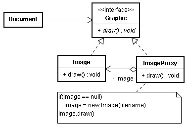
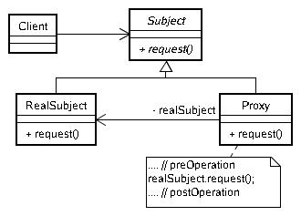
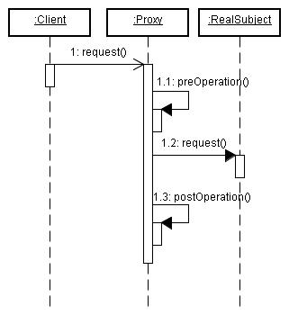
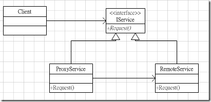

# Proxy 模式

您打算開發一個文書編輯器，文件中可以有圖片，如果您在載入文件時連同圖片一同載入：

```java
class Document {
    private Image image;
    ...
    Document() {
        image = new Image("doc://images/xxx.jpg");
    }

    void scroll() {
        ...
        image.draw();
        ...
    }
}
```

若文件中有很多圖片，則開啟文件的速度可能非常慢，但實際上，圖片可能在文件的中間，開啟文件後顯示第一頁時，圖片並不用繪製出來，在一開始載入所有的圖片實非必要，若可以的話，在要顯示時再載入該圖片，將可以加快開啟文件的速度。

您可以改寫為這種方式：

```java
interface Graphic {
    void draw();
}

class Image implements Graphic {
    ...    
    public void draw() {
        ...
    }
}

class ImageProxy implements Graphics {
    private Graphic image;
    private String firename;
    ImageProxy(String firename) {
        this.firename = firename;
    }
    public void draw() {
        if(image == null) {
            image = new Image(filename);
        }
        image.draw();
    }
}

class Document {
    private Graphic image;
    Document() {
        image = new ImageProxy("doc://images/xxx.jpg");
    }

    void scroll() {
        ...
        image.draw();
        ...
    }
}
```

文件載入並建立 Document 時，建立的是 ImageProxy 實例，在真正需要繪製圖片時，才會真正建立 Image 實例並進行繪製動作，使用這種方式，即使文件中圖片很多，也不至於拖累開啟文件的速度。

以 UML 圖來表示這個例子：



以 Python 來示意一下實現：

```python
class Image:
    ...
    def draw(self):
        ...

class ImageProxy:
    def __init__(self, filename):
        self.image = None
        self.filename = filename
    def draw(self):
        if not self.image:
            self.image = Image(filename)
        self.image.draw()

class Document:
    def __init__(self):
        self.image = ImageProxy("doc://images/xxx.jpg")
    def scroll(self):
        ...
        self.image.draw()
        ...
```

這是 Proxy 模式的一個實例，您為其它的物件提一種代理，以控制對這個物件的訪問，根據您的目的不同，您的代理物件將負有不同的質任，因而產生多種不同的代理情況。



在調用 RealSubject 的 request() 之前， Proxy 物件也許會有一些預先處理的操作，就假設我們組織為 preOperation() 與 postOperation() 好了，當客戶對 Proxy 發出 request() 請求後，一個可能的時序圖如下所示：



您的 preOperation() 與 postOperation() 正決定了 Proxy 模式使用於何種情況，例如可能是在某個方法呼叫前後作日誌的動作，或甚至作為攔截(JVV)器，以條件決定是否呼叫真正的物件等。

---

https://dotblogs.com.tw/alonstar/2011/05/13/25025

代理模式如同字面上的意思，當我們想要做某件事的時候（ex：買衣服），不直接存取原始物件（直接找工廠），而是透過代理的管道（代理商）來處理。最常用到的大概有：

1. 遠端代理（Remote）：代理遠端程時執行，例如我們可以透過 WebService 的 WSDL 定義產生中介檔的函式庫，透過這個函式庫就可以存取 WebService 。
2. 虛擬代理（Virtual）：將需要秏費大量時間或是複雜的實體，利用代理模式的物件代替。
3. 安全代理（Rrotect or Access）：控制物件存取時的許可權。
4. 智慧參考（Smart Reference）：提供比原有物件更多的服務。

其它還有很多啦，像是快取也算是一種 Proxy 的應用，以 UML 架構表示如下：



簡單程式範例：

```c#
{
    static void Main(string[] args)
    {
        IService proxy = new ProxyService();
        proxy.DoWork();
    }
}

interface IService
{
    void DoWork();
}

class ProxyService : IService
{
    private RemoteService _rs;
    public ProxyService()
    {
        _rs = new RemoteService();
    }
    public void DoWork()
    {
        _rs.DoWork();
    }
}

class RemoteService : IService
{
    public void DoWork()
    {
        Console.WriteLine("Hello Word");
    }
}
```

---

