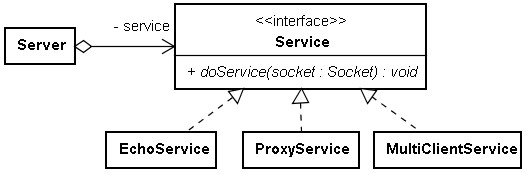
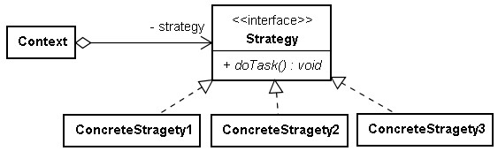

# Strategy 模式

觀察伺服器接受連線與處理服務的行為：

```java
ServerSocket server = new ServerSocket(port);
Socket client = server.accept();
InputStream input = client.getInputStream();
OutputStream output = client.getOutputStream();
....
client.close();
```

伺服器撰寫時，會進行 ServerSocket 的建立、呼叫 accept() 傾(PFT)聽連線、取得客戶端 Socket 等基本動作，真正不同的部份是連線之後的服務流程，如果您想要設計一個通用的伺服器框架，可以將連線之後真正的服務流程獨立出來，封裝為服務物件，例如：

```java
import java.io.*;
import java.net.*;

interface Service {
    void doService(Socket client) throws IOException;
}

class Server {
    private ServerSocket server;
    private Service service;
    
    Server(int port, Service service) throws IOException {
        this.server = new ServerSocket(port);
        this.service = service;
    }
    
    void start() throws IOException {
        while(true) {
            Socket client = server.accept();
            service.doService(client);
        }
    }
}
```

假設您要設計一個 Echo 服務器，則可以實作 Service 介面，例如：

```java
import java.io.*;
import java.net.*;

class EchoService implements Service {
    public void doService(Socket client) throws IOException {
        BufferedReader reader = null;
        PrintStream writer = null;
        try {
            reader = new BufferedReader(
                         new InputStreamReader(client.getInputStream()));
            writer = new PrintStream(client.getOutputStream());
            String input = reader.readLine();
            writer.println(input);
        }
        finally {
            client.close();
        }
    }
}

public class Main {
    public static void main(String[] args) throws Exception {
        Server server = new Server(9999, new EchoService());
        server.start();
    }
}
```

依您的服務策略不同，您可以實作不同的 Service 物件，只要抽換掉服務物件，就可以有不同的服務策略，這是 Strategy 模式的一種實現：



**Strategy 模式著重在服務細節或演算流程的封裝，將服務與演算法封裝為一個個的 Strategy 物件，讓使用服務或演算法的客戶端可以依需求抽換服務或演算法，而不用關心服務或演算法的實作方式。**以上面的範例來說，實際連線之後所提供的服務， Server 並不用知曉， Service 也許如範例實作為簡單的 Echo 服務，也許實作為代理伺服器服務，或是更複雜具有多執緒池的多人連線通用服務。

以更一般的方式來顯示 Strategy 的結構：



Context 是 Strategy 物件的客戶端，本身可能有些既定的流程，但在某些地方希望可以彈性的抽換 Strategy 物件，從使用 Context 的角度來看，不同的 Stratedgy 物件可能會影響 Context 的具體功能（如以上的範例），也有可能只是內部演算法不同，但不影響 Context 的行為（例如也許只是將氣泡排序改為快速排序）。

Python 的 socketserver 模式在 TCPServer 與 Handler 設計上，亦採用了 Strategy 模式，如果以 Python 來實現這個範例的話，如下所示：

```python
import socketserver

class EchoHandler(socketserver.StreamRequestHandler):
    def handle(self):
        self.data = self.rfile.readline().strip()
        self.wfile.write(self.data)

server = socketserver.TCPServer(("localhost", 9999), EchoHandler)
server.serve_forever()
```

在 Java SE 中 Strategy 的實例是視窗程式中 Container 與 LayoutManager 的關係， Container 對其所包納的元件該如何排列，是依所給定的 LayoutManager 而定（例如 Border Layout 、 FlowLayout）。