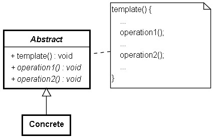

# Template Method 模式

您想要設計一個猜數字遊戲，猜數字遊戲的流程大致就是：

顯示訊息（歡迎）
隨(XW)機產生數字
**遊戲迴圈**
​	顯示訊息（提示使用者輸入）
​	**取得使用者輸入**
​	**比較是否猜中**
​	顯示訊息（輸入正確與否）

在描述流程輸廓時，並沒有提及如何顯示訊息、沒有提及如何取得使用者輸入等具體的作法，只是**歸納出一些共同的流程步驟**：

```java
 abstract class GuessGame {
    protected String welcome;
    protected String prompt;
    protected String correct;
    protected String bigger;
    protected String smaller;
   
    void go() {
        message(welcome);
 
        int number = (int) (Math.random() * 10);
        int guess = 0;
        do {
            message(prompt);
            guess = guess();
            if(guess > number) {
                message(bigger);
            }
            else if(guess < number) {
                message(smaller);
            }
        } while(guess != number);
       
        message(correct);
    }

    protected abstract void message(String message);
    protected abstract int guess();
}
```

如果是個文字模式下的猜數字遊戲，可以將顯示訊息、取得使用者輸入等以文字模式下的具體作法實現出來。例如：

```java
mport java.util.Scanner;

class ConsoleGame extends GuessGame {
    private Scanner scanner;
   
    ConsoleGame() {
        welcome = "歡迎";
        prompt = "輸入";
        correct = "猜中了";
        bigger = "你猜的比較大";
        smaller = "你猜的比較小";
        scanner = new Scanner(System.in);
    }
   
    protected void message(String msg) {
        System.out.println(msg);
    }
   
    protected int guess() {
        return scanner.nextInt();
    }
}

public class Main {
    public static void main(String[] args) {
        GuessGame game = new ConsoleGame();
        game.go();
    }
}
```

這是 Template Method 模式的實例，其在抽象父類別中定義好某個操作的整體流程，而在子類別中才將流程中一些未定的操作實現出來：



如果以 Python 來實現：

```java
import random
from abc import ABCMeta, abstractmethod

class GuessGame(metaclass=ABCMeta):
    @abstractmethod
    def message(self, msg):
        pass

    @abstractmethod
    def guess(self):
        pass     

    def go(self):
        self.message(self.welcome)
        number = int(random.random() * 10)
        while True:
            guess = self.guess();
            if guess > number:
                self.message(self.bigger)
            elif guess < number:
                self.message(self.smaller)
            else:
                break
        self.message(self.correct)

class ConsoleGame(GuessGame):
    def __init__(self):
        self.welcome = "歡迎"
        self.prompt = "輸入數字："
        self.correct = "猜中了"
        self.bigger = "你猜的比較大"
        self.smaller = "你猜的比較小"
    
    def message(self, msg):
        print(msg)
    
    def guess(self):
        return int(input(self.prompt))

game = ConsoleGame()
game.go()
```

在 Java 中要選寫 Servlet ，會繼承 HttpServlet 類別，針對 GET 方法的請求，會重新定義 doGet() 方法，針對 POST 方法的請求，會重新定義 doPost() 方法…。事實上，這也是 Template Method 模式的實際例子，因為在 HttpServlet 處理請求的 service() 方法中，是這麼定義的：

```java
protected void service(HttpServletRequest req, 
                           HttpServletResponse resp)
        throws ServletException, IOException {
        String method = req.getMethod(); // 取得請求的方法
        if (method.equals(METHOD_GET)) { // HTTP GET
            // 略...
            doGet(req, resp);
            // 略 ...
        } else if (method.equals(METHOD_HEAD)) { // HTTP HEAD
            // 略 ...
            doHead(req, resp);
        } else if (method.equals(METHOD_POST)) { // HTTP POST
            // 略 ...
            doPost(req, resp);
        } else if (method.equals(METHOD_PUT)) { // HTTP PUT
            // 略 ...
    }
```

當請求來到時，容器會呼叫 Servlet 的 service() 方法，而可以看到， HttpServlet 的 service() 中所定義的，基本上就是判斷 HTTP 請求的方式，再分別呼叫 doGet() 、 doPost() 等方法，所以若您想針對 GET 、 POST 等胡法進行處理，才會只需要在繼承 HttpServlet 之後，重新定義相對應的 doGet() 、 doPost() 方法。

Template Method 模式著重的是在父類別實作骨架，而將未實作抽象方法部份留待子類別來實作。先前在說明 Factory Method 模式前，其實就曾使用過 Template Method 模式。

Factory Method 模式將實際要建立的物推遲至子類中決定，而 Template Method 模式則是將框架中抽象的流程部份留待子類來解決。在 Factory Method 模式的例子中，從物件建立的角度來看， createDocument() 是 Factory Method ，而從流程框架的角度來看 createDocument() 則是 Template Method 模式的一個方法實作。